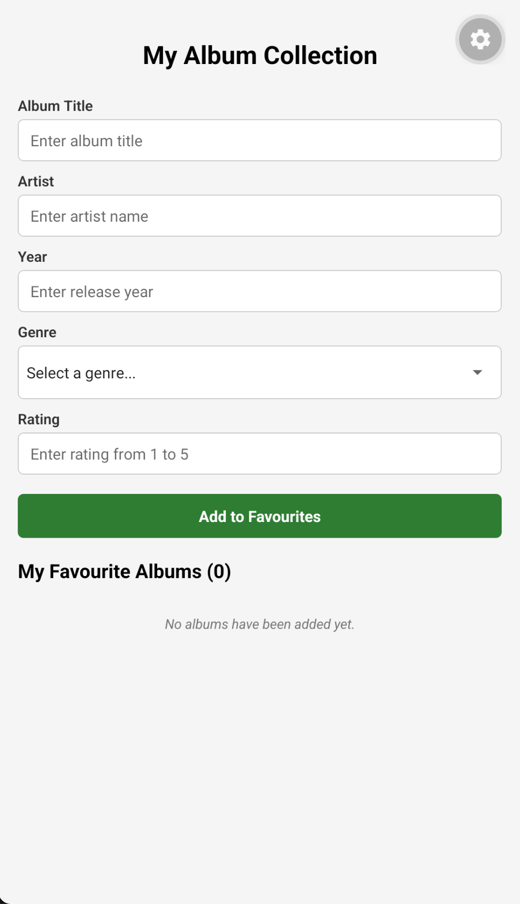

My Album Collection App
=======================

GitHub Repository: https://github.com/ST10519974/MAST-ICE_TASK

Project Overview
----------------

My Album Collection is a React Native mobile app built with Expo and TypeScript. The user enters an album title, artist, release year, genre and rating, adds the album to a "My Favourite Albums" list, and can delete albums from that list again. The form is validated before an album is saved.

Technologies Used
-----------------

- React Native
- Expo
- TypeScript
- @react-native-picker/picker (genre dropdown)

How to Run the App
------------------

1. Open the project folder in Visual Studio Code.
2. Install the dependencies: npm install
3. Install the picker package: npx expo install @react-native-picker/picker
4. Start the development server: npx expo start
5. Press "a" to open the Android emulator (or "i" for the iOS simulator).

App Screenshot
--------------

The screenshot below shows the corrected application running in the emulator.

Summary of Errors Found
-----------------------

The supplied App.tsx contained four errors. Each one is documented below with its location, why it occurs, and how it was corrected.

1. Faulty validation logic (validateForm function)
2. Genre Picker bound to the wrong values (Picker component)
3. Album object created incorrectly (handleSave function)
4. Incorrect album list handling (handleDelete function and FlatList keyExtractor)

Error 1: Faulty Validation Logic
--------------------------------

Location: validateForm() function

What was wrong:

The validation rules did not match the validation messages shown to the user. There were two problems.

(a) The title and artist length checks used the AND operator (&&). A text length cannot be smaller than 2 and larger than 50 at the same time, so the condition could never be true. Titles and artist names that were too short (1 character) or too long (over 50 characters) were accepted.

(b) The year and rating checks only tested one side of the allowed range. The year was only compared against MIN_YEAR, so a future year such as 3000 was accepted even though the message says the year must be between 1900 and the current year. The rating was only compared against 1, so a rating such as 10 was accepted even though the message says it must be between 1 and 5. The currentYear variable and the MAX_RATING constant were only used inside the message text and never in a comparison.

Why it occurs:

The wrong logical operator was used for the length checks (AND instead of OR), and the upper-limit comparisons for year and rating were missing.

Given code:

    title.trim().length < MIN_TEXT_LENGTH &&
    title.trim().length > MAX_TITLE_LENGTH

    artist.trim().length < MIN_TEXT_LENGTH &&
    artist.trim().length > MAX_ARTIST_LENGTH

    if (numericYear < MIN_YEAR) { ... }

    if (numericRating < 1) { ... }

Corrected code:

    title.trim().length < MIN_TEXT_LENGTH ||
    title.trim().length > MAX_TITLE_LENGTH

    artist.trim().length < MIN_TEXT_LENGTH ||
    artist.trim().length > MAX_ARTIST_LENGTH

    numericYear < MIN_YEAR || numericYear > currentYear

    numericRating < 1 || numericRating > MAX_RATING

Result after correction:

Titles and artist names must be between 2 and 50 characters, the year must be between 1900 and the current year, and the rating must be a whole number from 1 to 5. Invalid input is now rejected.

Error 2: Genre Picker Bound to the Wrong Values
-----------------------------------------------

Location: Genre Picker in the returned JSX

What was wrong:

The Picker was wired to the wrong state values in two places.

(a) selectedValue was set to the title state instead of the genre state, so the Picker did not display the genre the user had chosen.

(b) Every Picker.Item was given value={genre} (the current genre state) instead of its own genre. Because genre starts as an empty string, every option had the same empty value. Choosing any genre set the genre state back to an empty string, so the "Please select a genre" validation always failed and the form could never be submitted.

Why it occurs:

The Picker was connected to the wrong state variable, and the items used the state variable instead of the loop variable (item) from genres.map().

Given code:

    selectedValue={title}

    <Picker.Item key={item} label={item} value={genre} />

Corrected code:

    selectedValue={genre}

    <Picker.Item key={item} label={item} value={item} />

Result after correction:

The chosen genre is shown in the Picker, is stored in the genre state, passes validation, and is displayed on the saved album card.

Error 3: Album Object Created Incorrectly
-----------------------------------------

Location: handleSave() function

What was wrong:

(a) The Album type declares year and rating as strings, but the temporary album object assigned them as numbers using Number(year) and Number(rating). This is a type mismatch and causes a TypeScript error.

(b) The album list was replaced instead of added to. setAlbums([temporaryAlbum]) overwrote the whole array every time, so only the most recently added album was ever kept.

Why it occurs:

The object did not follow the Album type declaration, and the state update did not include the existing albums.

Given code:

    year: Number(year),
    rating: Number(rating),

    setAlbums([temporaryAlbum]);

Corrected code:

    year: year.trim(),
    rating: rating.trim(),

    setAlbums((prevAlbums) => [...prevAlbums, temporaryAlbum]);

Result after correction:

The album object matches the Album type, and each new album is added to the existing list. Multiple albums can be stored and the "My Favourite Albums" counter increases correctly.

Error 4: Incorrect Album List Handling
--------------------------------------

Location: handleDelete() function and the FlatList keyExtractor

What was wrong:

(a) The delete filter used the equals operator (===). It kept only the album that was meant to be deleted and removed every other album from the list.

(b) The FlatList keyExtractor used item.title as the key. Two albums can have the same title, which produces duplicate keys, React warnings and unreliable rendering. The unique id created for each album when it is saved was not being used.

Why it occurs:

The filter condition was inverted (=== instead of !==), and the key was based on a value that is not guaranteed to be unique.

Given code:

    currentAlbums.filter((album) => album.id === id)

    keyExtractor={(item) => item.title}

Corrected code:

    currentAlbums.filter((album) => album.id !== id)

    keyExtractor={(item) => item.id}

Result after correction:

Pressing Delete removes only the selected album and leaves the rest of the list intact. Every album has a unique key, so the list renders reliably even when albums share a title.

Summary of Corrections
----------------------

1. validateForm(): changed && to || for title and artist length checks, and added the missing upper-limit checks for year and rating.
2. Genre Picker: changed selectedValue from title to genre, and changed each Picker.Item value from genre to item.
3. handleSave(): stored year and rating as strings to match the Album type, and appended the new album to the existing list.
4. handleDelete() and keyExtractor: changed === to !== in the delete filter, and used item.id instead of item.title as the list key.